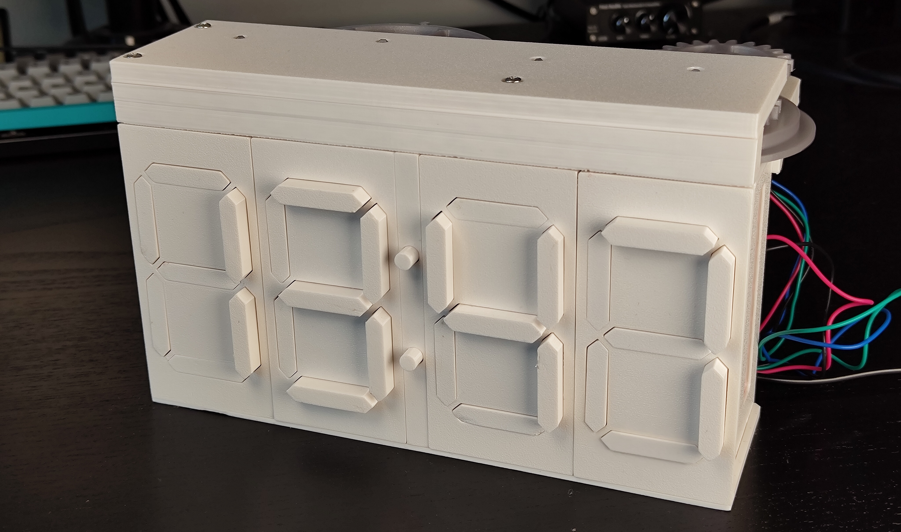
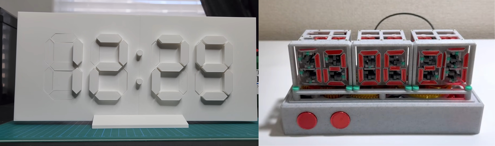
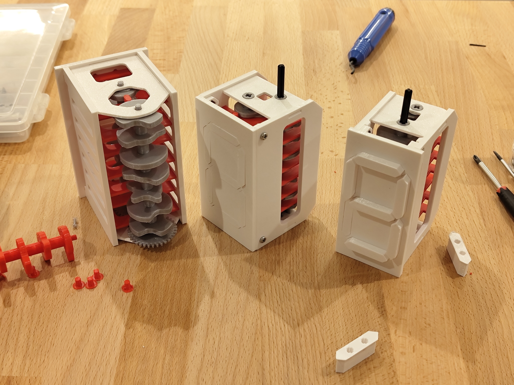
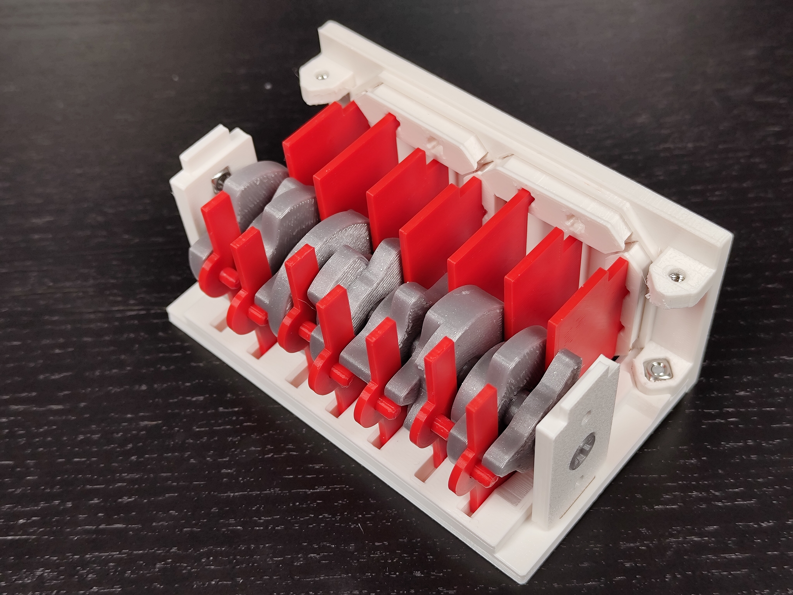
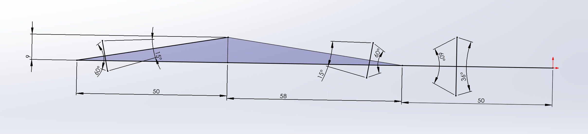
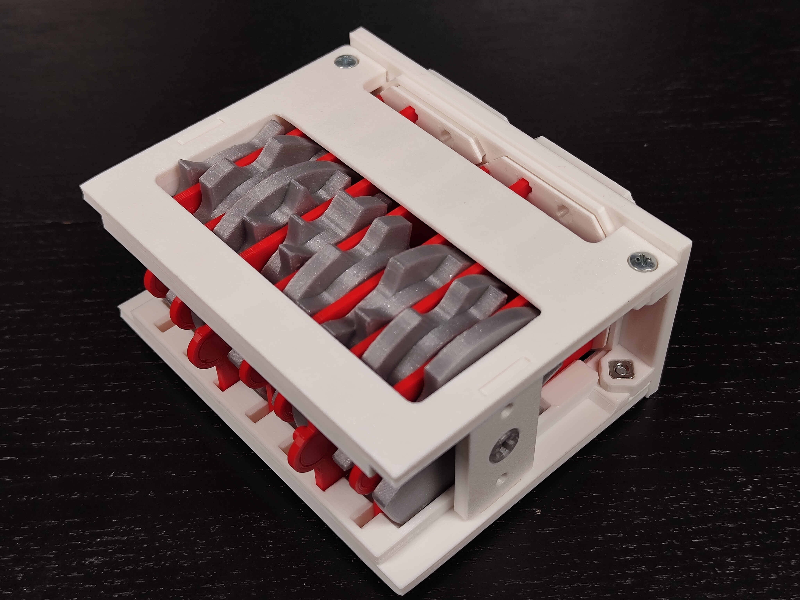
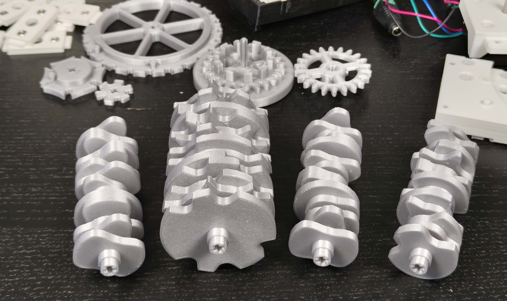
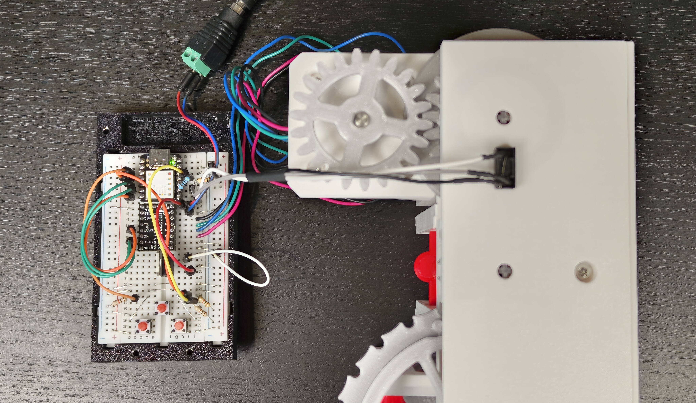
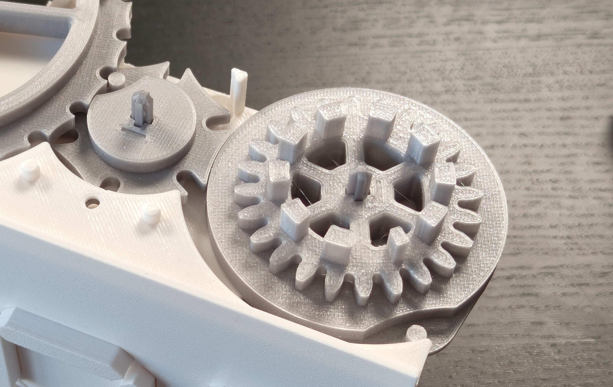
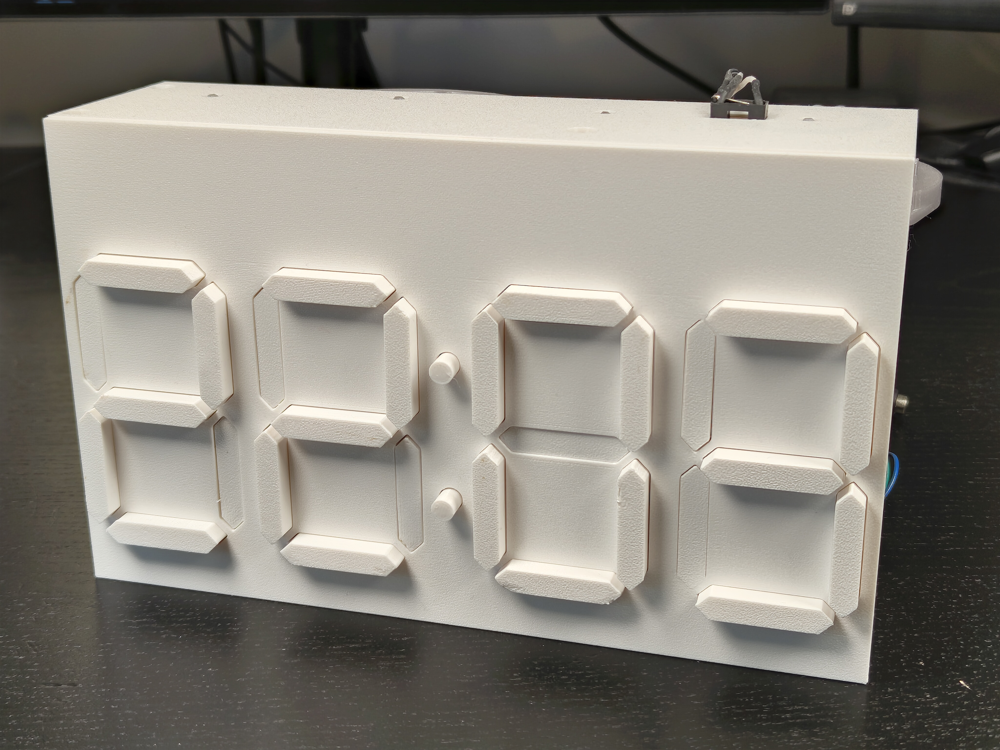

This post is about building a 3D printed, mechanical digital clock, made out of [seven-segment displays](https://en.wikipedia.org/wiki/Seven-segment_display). <!--more-->
The project was inspired by a [video by Lukas Deem](https://www.youtube.com/watch?v=YQLStT4RXVo), who built a clock with seven-segment displays where the segments slide in and out when they change their state.
In his design, each segment is controlled by a separate servo.
I was also inspired by [various](https://www.youtube.com/watch?v=TmxXhfyIY5g) [projects](https://www.youtube.com/watch?v=s-VhmYrKIWA) from the Karakuri channel, that use camshafts to drive seven-segment displays entirely mechanically.

I wanted to combine the sliding in and out aesthetic of the white segments from the former with the mechanical approach from the latter.

# Cam designs

To display ten different numbers, each of the seven segments needs to go through a sequence of ten stops, where the segment is either active or inactive.
Here is an early test where I printed a camshaft to push a follower back and forth.
It already has ten stops and this prototype confirmed that my code was working to generate 3D cam shapes based on a sequence of segment states.

Here are some early iterations of digits I printed:

It has two camshafts with seven cams, so that each segment can be pushed out by one cam and pulled back in by the other.
At the bottom, the camshafts are connected by a pair of gears so that they rotate at the same time.

A lot of iteration was done to make the digits run reliably, without too much resistance and without getting jammed.
Another big improvement was putting the pushing and pulling cam on the same camshaft, reducing the overall complexity and part count.
This is the design I ended up with:

Each of the seven pushers has two pins, one above and one below, which engages with a cam to push it in one or the other direction.
This could also be achieved with a single cam and a spring, but I wanted to avoid tensioning the parts.

You can see that the side panels ended up being quite thick.
When the camshaft pushes against the pins, it's important that the sliders move back and forth, instead of the walls bending and the sliders moving left and right.
With the final design, everything should move smoothly right after printing but adding silicone spray helps a lot with 3D printed mechanical projects.

# Connecting four digits

Having designed one digit, the next step is to connect multiple digits.
For this, I'm using a mechanism called [Geneva drive](https://en.wikipedia.org/wiki/Geneva_drive), which will advance the tens digit of minutes by one when the ones digit of minutes goes from 9 to 0.
This is what it looks like:

Note that the ones and tens digits have different camshafts, the ones digit cycles through the numbers 0 to 9, while the tens only goes up to 5 and it goes back to zero after minute 59.

Another interesting constraint is that both digits need to advance by one number while the pin of the Geneva drive is engaged.
That means that the ones camshaft advances by 360/10 degrees, since it has 10 stops and the tens cam advances by 360/6 degrees, since it has 6 stops.
This requirement fully determines the position of the pin and the radii of the two wheels of the Geneva drive.
In a standard Geneva drive, the pin enters and leaves the notch straight on, which is not the case in my design since it would dictate the distance and radii of the wheels.

The hours digits also have unique camshafts, although there is a special case with the ones digit of hours.
To display 24 hours, the digit goes through 0 to 9, then through 0 to 9 again and then through 0 to 3.
After that, at midnight, it transitions from 3 back to 0.
I considered different ways of implementing this mechanically.
It would be cool to have 10 digits and somehow skip from 3 to 0 at every third run.
Eventually I decided to just make a camshaft with 24 stops, which is not as elegant but solves the problem.
As a result of that, the ones digit of hours is bigger than the other digits.

The tens digit of hours has a similar problem, it only needs to show 0, 1 and 2.
This would mean that the Geneva drive needs to move 120° when it engages, which is too much.
For this reason, the camshaft of the tens digit of hours stops at these three numbers twice, for 6 total stops.

These are the four camshafts in the clock:

Here is the final design with all three Geneva drives engaging simultaneously when the clock rolls over at 23:59:

Note that the large Geneva drive wheel has three pins placed so that they engage after 9, 19 and 23 hours.

# Motorization

The next step was to motorize the clock.
For it to function as a real clock and display the time, it needs to advance once a minute.
I decided to use a stepper motor for this as it allows for precise angular movement.

Another advantage of using a stepper motor for mechanical art projects is that it is completely silent.
When the clock advances to the next minute, all you can hear is a little mechanical rattling.
The motor itself makes no noise.
You might think that a stepper motor is entirely sufficient to accurately drive the clock, but in practice this is not the case.
When turned on, the stepper motor will consume a fixed amount of power, even when not moving.
To save power, I turn it off between each minute advancement.
The motor holds its position while powered but moves with less resistance when powered off.
Sometimes this leads to small errors, which accumulate over time.

I printed a mounting bracket for the motor and a gear to transmit the power.
I use a TMC2209 stepper motor driver and a Seeeduino XIAO since it is compact and has USB-C.
The project also has a voltage regulator so that the 12V supply for the motors can be used to power the Arduino and three buttons to set the time.

# Rotary encoder

To avoid accumulating errors while the stepper motor is turned off, I added a rotary encoder to the ones of minutes axis.
The gear now has ten protrusions that interrupt an IR photo interruptor.

The photo interruptor consists of an IR LED and a photo sensor.
When a part moves into the interruptor, the sensor can no longer "see" the LED.
Note that the protrusion for the zero digit is a bit thinner.
By measuring how long the sensor is interrupted, the Arduino can tell if the current digit is zero.

Here is the mechanism in action:

I also updated the design a bit to allow a single front panel.
The clock is made up of four digits, the "colon" separator panel in the middle and top and bottom parts to hold it all together.
These segments were visible from the front, but this new design avoids all the gaps by using a single decorative front panel.

# Keeping time and practicality

The clock has a power supply that plugs into a wall outlet.
As long as it has power, it will accurately advance its time once a minute.
It doesn't produce much noise, just a subtle mechanical rumble once every minute.
But every time the clock is turned on, the correct time needs to be set.
For this purpose, the clock has two buttons to go forward and backward.

I've considered adding a real-time clock module, which uses a tiny coin battery to keep the time even when the device is turned off.
For it to work, the Arduino would have to write the current RTC time to its EEPROM every time it moves.
This information is retained when the device loses power.
When it's turned back on, it would then have to read the current time from the RTC and the current clock state from the EEPROM and fast forward the clock by the difference between those two.

Another consideration is that the EEPROM in the Arduino has a limited number of write cycles.
I don't know how this will play out in practice, but if the device is limited to 100,000 writes, it could only operate for a few months.

I haven't done this yet, but it's the one remaining feature that I have in mind for this project.
Since I've just now written the blog post, the project is complete and this probably won't happen.
But I wanted to mention it so that you know I've thought about this problem!

# Conclusion

One common piece of feedback I've received relates to the contrast of the segments.
I've specifically chosen this style where the segments slide in and become invisible.
Yes, the contrast is low but in practice it's not really a problem.
It's tricky to catch this on photos but in real life, you can easily tell the time.
Also, it's more of an art project than a practical clock.
There are ways to make the segments pivot out of view, but it just doesn't look as nice.

If you'd like to make your own version of this clock, you can get the [files for free on Printables](https://www.printables.com/model/859674-mechanical-digital-clock-24-hours).
You can also just print a [single digit](https://www.printables.com/model/834965-mechanical-seven-segment-display-version-2).
If you're interested in printing mechanical seven segment displays, also check out [this design](https://www.printables.com/model/959686-7-segment-mechanical-counter-version-30-ratchet-fo) (not by me), which has segments sliding in and out of view for higher contrast.