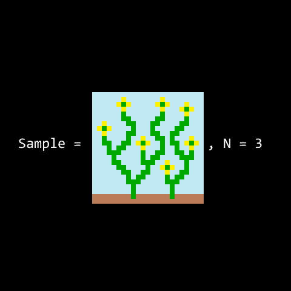



This article describes how I generate an infinite city using the Wave Function Collapse algorithm in a way that is fast, deterministic, parallelizable and reliable.
It's a follow-up to [my 2019 article](/article/wfc/) on adapting the WFC algorithm to generate an infinite world.
The new approach presented in this article removes the limitations of my original implementation. <!--more-->
I first mentioned these ideas in this [Twitter thread](https://twitter.com/marian42_/status/1490060483944140804).

# Objective

The goal is to procedurally generate a 3D environment by placing human designed blocks on a 3D grid.
The blocks need to be placed in accordance with given adjacency constraints.
For each of the 6 sides of a block, some information about the face and its symmetry is used to generate a list of possible neighbors.



This is different from the original formulation of the [WFC algorithm](https://github.com/mxgmn/WaveFunctionCollapse), where the possible blocks, their adjacency rules and their spawn probabilities are extracted automatically from an example texture.

With the improvements described here, the generation method is robust enough to be shipped in a commercial game.
For this, it needs to be reliable, fast and allow for artistic control over the result.

# Wave Function Collapse

This article is aimed at readers who already know how the [WFC algorithm](https://github.com/mxgmn/WaveFunctionCollapse) works, but here is a brief recap.
I'm skipping the part where blocks are extracted from an example texture and only use the part where we generate a new "texture".

  
(Gif by [Maxim Gumin on Github](https://github.com/mxgmn))

The algorithm starts with an array of slots (the "wave function"), where nothing is decided.
Each slot has a list of possible blocks (or "modules") that can be placed there and in the starting state, each list contains all modules.
The algorithm will then do collapse steps and a constraint propagation steps until the map is fully collapsed or until it has reached a dead end.

## Collapse step
We pick the slot with the lowest entropy and collapse it.
That means we pick one of the modules from that slot's list of possible modules and set it as the selected module for this slot.
Intuitively, the "slot with the lowest entropy" is the one with the least amount of choice.
If all modules have the same spawn probability, the slot with the fewest possible modules is the one with the lowest entropy.

## Constraint propagation
Collapsing a slot effectively shrinks the list of possible modules of that slot to 1.
The constraint propagation step propagates this information through the map by removing modules from the respective lists of other slots that have been ruled out by the latest collapse step.
The constraint propagation step of the WFC algorithm is the most compute intensive part.

## End
The algorithm terminates when all slots are collapsed, which means success, or when the list of possible modules for any slot is empty.
In that case the procedure has failed and one could backtrack or start over.

# The original approach and its limitations

(skip this section if you just want to know the solution)

WFC is usually applied to finite maps that can be stored in an array.
In my [original post](/article/wfc/), I described why I thought it would be impractical to do a chunk-based WFC implementation.
I had not figured out how to avoid the problem that constraints need to be propagated across chunk boundaries.
Instead, I stored the map in a dictionary, where new slots would be allocated when they were generated or when they were touched by constraint propagation.
That means, even to geneate a small area of the map, a large cloud of slots around that area would be allocated since constraint propagation could "bounce back" into the area we're interested in.

Problems of that approach include:

**Non-determinism**: The result of the generation depends on the order in which parts of the map are generated (and thus on the path the player takes).  
**Memory leak**: We can't release the memory used to generate a part of the world when the player leaves since we don't know at what point distant slots no longer have an effect on local world generation.  
**Reliability**: The longer you walk around, the higher the chance becomes that the WFC algorithm runs into a dead end and is unable to continue generating the map.  
**Single threaded**: Since there are no chunks, all operations on the map datastructure need to be sequential and can't run in multiple threads.
In practice, the map height had to be limited so that the map generation was fast enough.



My implementation of the old approach is still [available on Github](https://github.com/marian42/wavefunctioncollapse) and a playable demo is on [itch.io](https://marian42.itch.io/wfc).
If you want to implement your own WFC algorithm, you shouldn't do it like that though!

In the next part, I'll describe my solution to all of the aforementioned problems.

# Chunk-based WFC

The idea is to start with a simple, pre-generated, tiling map and generate "fitting" replacements at runtime.
However, we do this at an offset so that the seam at the chunk borders (which would otherwise look the same for each chunk) is replaced.
In this section, I'll explain in detail what that means.

This solution is a refinement of ideas proposed by [Paul Merrel](https://paulmerrell.org/model-synthesis/) and [BorisTheBrave](https://www.boristhebrave.com/2021/11/08/infinite-modifying-in-blocks/).

We start by generating a simple, finite, tiling, 8x8x8 map:



This is done offline.
We use a small subset of the available modules to make it as simple as possible.
The map is *tiling* in the sense that the boundaries on opposite sides match, so copies of this map could be placed next to each other seamlessly.
Doing that would look like this:



Generating the tiling map is done by "wrapping around" the constraint propagation at the map boundary.
In a finite map, when we propagate a constraint to a slot outside the map, we discard that information.
In a tiling map, the slot on the opposing map boundary is treated as if it was a neighbor.

Next, we pre-generate a set of replacements for our starting map.



We use the boundary of the starting map as a boundary constraint to generate these replacements.
For any slots on the boundary of these new maps, we only allow modules with a matching profile for those sides that face the map boundary.
This means that we can "swap out" our starting map with any of the pre-generated patches without getting mismatched blocks at the boundary.

Now we can randomly choose from our collection of pre-generated patches at runtime and we have a simple chunk-based infinite world generator:



Note that we're not doing any WFC generation at runtime yet, we're just placing pre-generated 8x8x8 block patches.
Since all these patches have a matching boundary, we can spot this chunk boundary as an unnatural pattern in the generated world.

Now for the important part:
At runtime, we generate an 8x8x8 replacement map for each chunk, **but we do it at a 4 block offset in both horizontal directions**.
The starting point for each chunks's generation is made up of the four pre-generated patches that touch it.
The replacement map we generate at runtime has a boundary constraint to "fit in", just like our pre-generated patches.
However, due to the offset, the boundary that is shared between all pre-generated patches is replaced at runtime and the area that is different in every pre-generated patch remains unchanged during the runtime generation.
(This is needed so that neighbor chunks can be generated independently from each other.)
If this replacement map fails to generate, we just keep the blocks from the starting patches.

Here is the result of that:



Notice how the chunk boundary artifacts from the previous screenshot are gone!



Consider this drawing, where the gray blocks are one chunk (seen from above).
We determine the four starting patches that overlap this chunk (the blue boxes).
This needs to be random but deterministic, since neighbor chunks will need to use the same starting chunks.
We query the pre-generated patches at the boundary of the chunk (shown in green) and use this as the boundary constraint for the generation of the chunk.

The green boundary area will stay the same during runtime generation, but this looks ok due to the variance in the pre-generated patches.
The blue boundary is the same for each pre-generated patch, but will be replaced at runtime.

Note how this has the properties we want:
Each chunk can be generated deterministically and independently from other chunks.
If the generation for one chunk fails, we fall back to simply copying the blocks from the starting patches.

# Using a heightmap

In this section, I'll explain how to generate a world in the shape of an arbitrary heightmap.
This is done to achieve large-scale height differences, which are needed for a natural looking landscape.

Consider an integer heightmap where the difference between two adjacent points is always one.
The next point is either one above or one below, but never at the same level or anywhere else.

Each 2x2 cell in that heightmap has one of these six shapes:



For each of these six possible 2x2 cell shapes, we pre-generate a set of starting patches:



These starting patches are no longer tiling in the classic sense.
Instead, each side matches the opposite side with a vertical offset.

With our special integer heightmap where adjacent points always have a difference of 1, we will now generate one chunk for each point in the heightmap.
Our query point has four adjacent 2x2 cells.
For each 2x2 cell, we determine which of the six possible shapes it has and pick a pre-generated starting patch from the respective collection.
Then, we generate a replacement map as explained in the previous section.

Here is an example of the heightmap in engine, each chunk is represented as one flat box:



This mesh is used to render the world far away from the camera.
I added a "city like" texture and some billboard-rendered fake buildings.
In the foreground, you can see the actual chunks generated by the algorithm:



Okay, now we know how to turn our integer heightmap into a cool looking infinite WFC world, but how do we get that integer heightmap in the first place?
How do we get a function that generates an integer elevation function where the vertical difference between two adjacent points is always 1 or -1, but never 0 or anything else?

We start with a target function that doesn't have this property.
In my case, I'm using 8 octaves of Perlin noise, but any heightmap can be used here.

Then, we use an elaborate clamping process to force the step constraint on our target function.
It works in a hierarchical way, similarly to descending down a quadtree.
We start with a relatively large square (the root of the quadtree) and evaluate our target function for the four corners.
Then, we generate the heightmap value on the edge centers and the square center by querying the target function and then clamping the value to fulfil our slope constraint.
The slope constraint requires that the vertical difference is less than or equal the horizontal difference.
If our query point is inside any of the four quadrants, we repeat this process for the respective quadrant (descending the quadtree).
If our query point is one of the points we just calculated, we're done.

The hierarchical nature of this approach means that it lends itself very well to caching.

Here is a 2D visualization of the process:



The blue line shows the target function.
At every descend step down the quadtree, new limits are introduced to adhere to the slope constraint (shown as black lines).
The orange dots are the values of our resulting heightmap.

# Outlook and notes

Each chunk can be generated independently.
That makes it easy to parallelize the computation required to generate the world.
In my case, I'm using Unity's Burst compiler to do the runtime generation.

By varying the module probabilities for different areas of the map, I can generate different biomes.
Here is an example of a biome boundary:



The biome on the left spawns copper roofs and bridges, the one on the right spawns tiled roofs and arches.
On the boundary, there is one row of chunks where modules from both biomes can spawn, creating a natural looking transition.

I want to mention some progress on this project that is unrelated to the WFC algorithm.
Since my last blog post in 2019, I've created lots of new blocks, textured them, added a water plane and added procedurally generated trees and climbing plants.



The trees and plants are generated at runtime using the Space Colonization algorithm and adapt to the geometry of the world.

The next challenge is to come up with interesting gameplay ideas for this project.