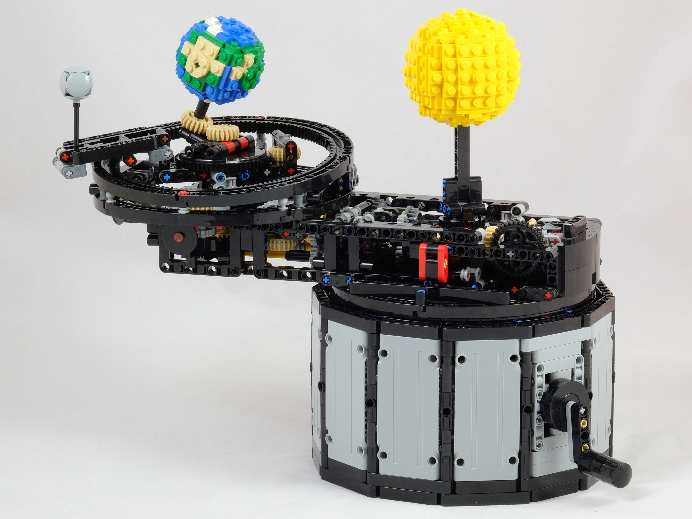

I've always been a fan of the Lego Technic series, especially those models that have gears and cranks and moving parts.
But it seems that Lego is shifting the focus of the Technic series away from functional models, so I had to take matters into my own hands.
I think an orrery is the perfect project to build out of Lego Technic parts as it makes for a cool display set and is functional at the same time.

<!--more-->

# Introduction

An [orrery](https://en.wikipedia.org/wiki/Orrery) is a scientific instrument that models the motion of the celestial bodies.
These are typically the orbital period and the period of the rotation around the axis of a body.
For example, the time it takes the moon to travel around the earth once is ~27 times the time it takes the earth to rotate around it's own axis (a day).
This relation is accurately modelled in an orrery.
However, the orrery does not model distances or the relative sizes of the celestial bodies.

I was very excited when I saw this [*Earth, Moon and Sun Orrery* design by JK Brickworks](https://jkbrickworks.com/earth-moon-and-sun-orrery/) in 2016:

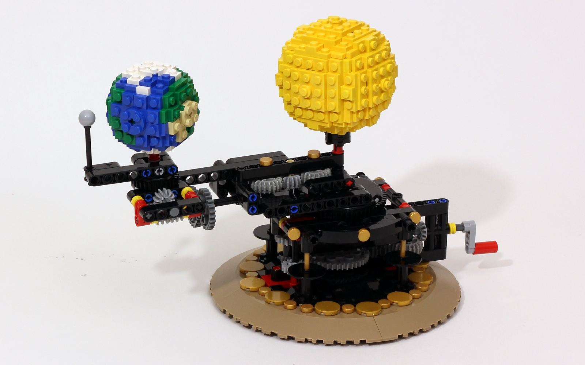

This inspired me to build my own orrery with the same spheres for the sun, earth and moon, but my own custom designed mechanism:

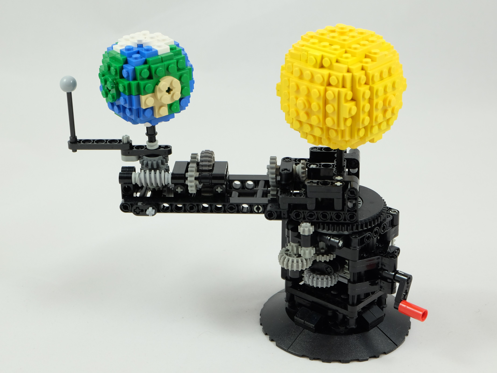

While working on this, I experimented with [3D printing custom fixtures to put Lego gears in](/article/partdesigner/), but eventually moved on to building an orrery out of Lego parts only.
This orrery is special in the sense that it was designed by me, but it doesn't have any features beyond what the design from JK Brickworks has to offer.
It models the orbit of the earh around the sun, the orbit of the moon around the earth, and the spin of the sun, earth and moon.

The moon is [tidally locked](https://en.wikipedia.org/wiki/Tidal_locking) to the earth, meaning it rotates once per orbit.
One half of the moon always faces the earth and the other always points away from it.
(This also means that if you're on the surface of the moon, the earth always stays in the same spot in the sky.)
The tidal locking means that the rotation of the moon easy to implement in an orrery, since the moon will move correctly as soon as it is attached to an arm that goes around the earth at the correct orbital period.
You only model the orbital period and get the rotational period for free.

To improve upon my first model, I wanted to add two more features: The axial tilt of the earth and the inclination of the orbit of the moon.

# Axial tilt

The rotational axis of the earth is tilted 23.5° relative to its orbital plane.
For the orrery, this means that the rotational axis of the earth is not pointing straight up.
To make matters worse, the axis always points in the same direction.
It does not rotate relative to the stars or the table that the orrery stands on, but it has to rotate relative to the main arm that holds the earth.
So not only does the earth itself rotate, the part that holds the earth also needs to rotate to cancel out the rotation of the arm.

Modelling this feature allows us to use the orrery to explain the origin of the seasons.

To construct the actual tilted holder for the earth sphere, I used an [angled connector](https://www.brickowl.com/catalog/lego-angle-connector-3-157-5-32016-42128) with a 22.5° angle, which is only one degree off the correct angle.

# Inclination of the orbit of the moon

The second pehonomenon I wanted to model in my orrery is the fact that the plane of [the moon's orbit](https://en.wikipedia.org/wiki/Orbit_of_the_Moon) is inclined relative to the plane of the earth's orbit.
The real inclination angle is 5.15°, which you would barely notice if it was modelled accurately.
But the inclination of the moon's orbit plays in important role in explaining when eclipses occur, so I think it is useful to model an exaggerated orbital inclination.

In the orrery, we need to make the moon go up and down along its journey around the earth.
My mechanical solution for this problem is inspired by [this video](https://www.youtube.com/watch?v=sL7bUoLnCN4).
The moon arm has a wheel that rides on a tilted [circular gear rack](https://www.brickowl.com/catalog/lego-1-4-circle-gear-rack-11-x-11-24121-43038).
A parallelogram linkage keeps the moon vertically aligned.
Just like the attachment point for the earth, this assembly rests relative to the stars, meaning it needs to rotate relative to the main arm.

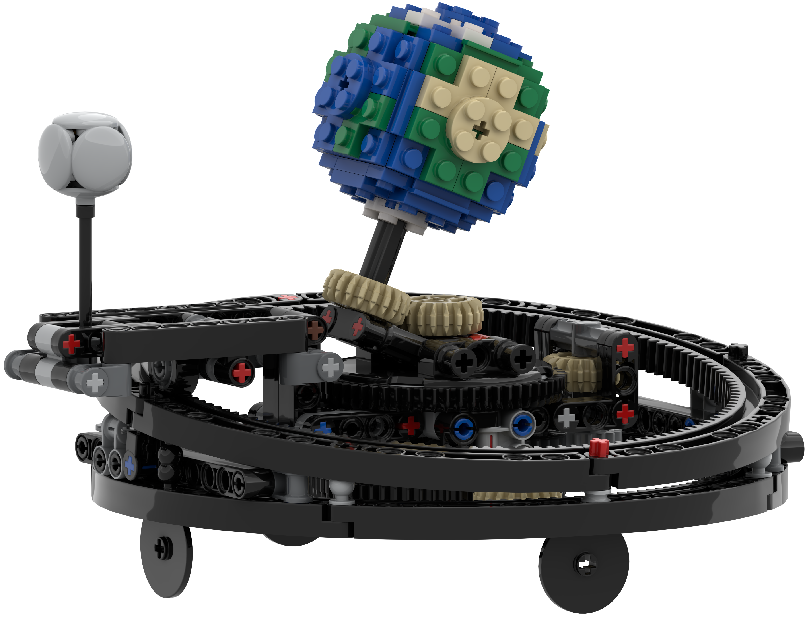

In summary, there are four parts on the earth arm that need to rotate at the correct rate:
- the earth,
- the base for the earth (to ensure the correct direction of the axial tilt),
- the moon,
- the inclination ring for the moon.

In theory, the earth base and the moon inclination ring could be a single part (both should rotate at the same rate).
But making a tilted ring out of Lego parts is difficult enough and I didn't manage to do it in a way where the moon "rides" on it while it is driven from the outside.
Thus, the solution to this is to make the moon inclination ring a separate assembly.

Being able to move the tilted ring independently allows us to implement an additional astrodynamic phenomenon, the [*precession of the nodes of the orbit of the moon*](https://en.wikipedia.org/wiki/Lunar_precession#Nodal_precession).
It turns out that the direction in which the upper and lower parts of the orbit are pointing isn't fixed after all.
They slowly rotate around the moon, once every 18.6 years.

# Concentric axes

One problem specific to building an orrery in Lego is achieving concentric rotation.
In a traditional orrery, you can have an unlimited number of parts rotating around the same axis just by placing tubes of increasing size inside each other.
But these tubes don't exist as Lego pieces.
For the earth-moon system, I need four assemblies rotating independently around the same axis.

Here is how I achieved it for the earth-moon subassembly:
The first axis (1) is a regular Lego Technic axle.
It drives the rotation of the earth.
The second axis (2) is built using a Lego Technic turntable.
It is responsible for the orbit of the moon.
The third axis (3) is a circular gear rack.
It fulfills the same role as a turntable, just with an inner radius large enough to fit another turntable inside it.
This part is the tilted ring that is needed to model the orbital inclination of the moon.
Now there is only one axis missing, which is the rotating holder for the earth (4).
Remember, it needs to rotate relative to the main arm of the orrery so that the rotational axis of the earth points at a constant direction.
This is done with a second turntable stacked on top of the first one.

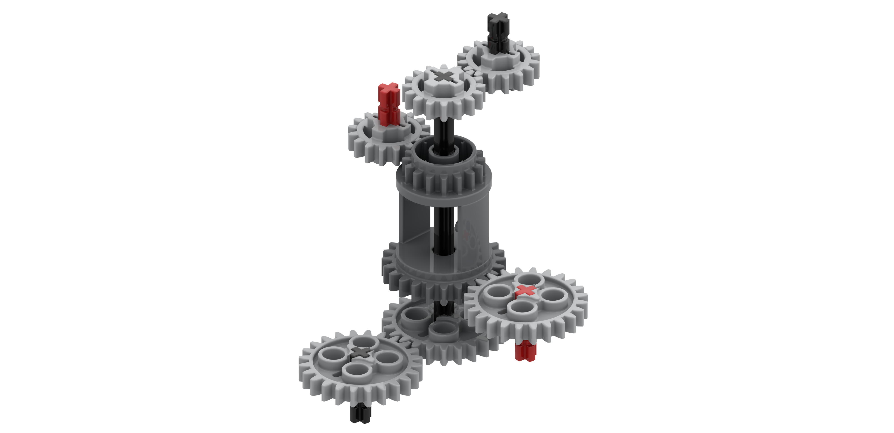

To drive it, I'm using this trick:
The [*Differential Gear Casing*](https://www.brickowl.com/catalog/lego-differential-gear-casing-6573) has a round hole and gears at both ends.
That means an axle can be placed inside it and rotate independently.
This can be used to transmit torque by connecting gears at both ends.
This serves the purpose of the aforementioned tubes that don't exist as Lego parts, with the exception of this gear casing.
The gear casing drives some gears on the first turntable, which in turn drive the second turntable.

# Gear sequences

The earth-moon subassembly has four axes that need to rotate at the correct period, namely the earth, the moon, the earth's base and the moon's inclination ring.
The entire orrery has two more: the rotation of the sun around its own axis and the rotation of the main arm, which makes the earth travel around the sun in 365.25 days.

The sun is not a solid body and [spins at different speeds depending on the latitude](https://en.wikipedia.org/wiki/Solar_rotation).
For orrery design, that means that any rotational period between 24 and 38 days can be argued to be correct, since there is a latitude of the sun where the surface rotates at this period.

This gives rise to the problem of finding a gear sequence for a given transmission ratio.
In my orrery, one rotation of the crank corresponds to one day.
So to get the main arm to rotate once every 365.25 days, it needs to be connected to the crank using a gear sequence with a transmission ratio that is as close as possible to 365.25.

The gear ratio of a gear sequence is the product of the fractions of tooth numbers for each pair of gears in the sequence.

To find a sequence of Lego gears, there are some additional constraints.
Most importantly, we are limited by the gears that Lego actually makes:

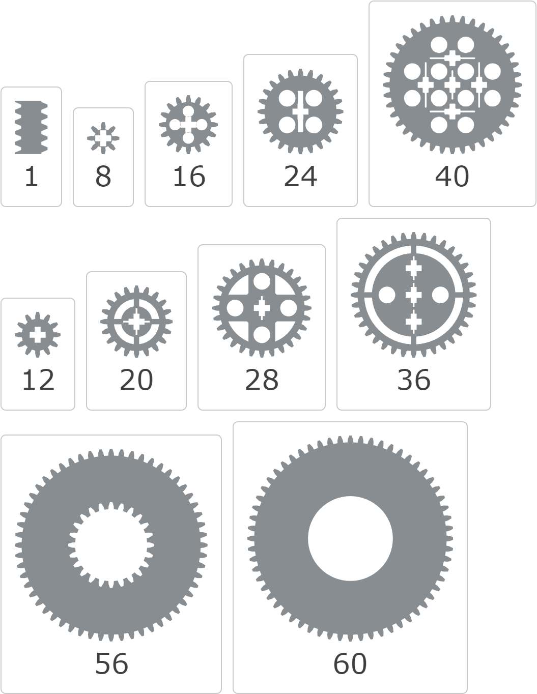

Notice the [worm gear](https://www.brickowl.com/catalog/lego-worm-gear-shape-axle-4716) in the above image.
It's special because it behaves like a one tooth gear, i.e. paired with a 24 tooth gear, it will create a transmission ratio of 1:24.
But it can only be the driving gear in a pairing, not the driven gear.

Suppose we want to achieve a transmission ratio of 17:23.
This could be done easily with a pairing of a 17-teeth and a 23-teeth gear in a traditional orrery.
But these teeth numbers aren't available as Lego gears, so we have to find another way.

I made [a tool](https://marian42.de/gears/?targetratio=17/23&error=default&incl2d=false&gears=default) to find Lego gear sequences for a given transmission ratio.
For our example of a 17/23 ratio, the app finds plenty of solutions with slightly different ratios, for example a ratio of 20/27, which is only 0.22% off from the target ratio:

The problem of finding a gear sequence for a given transmission ratio is connected to some interesting ideas from number theory.
It is closely related to [prime factor decomposition](https://en.wikipedia.org/wiki/Integer_factorization).
In fact, an exact solution is only possible if all the prime factors in the target ratio are also available as prime factors in the available gears.

The tool will start from the target fraction (or slightly different fractions when searching for approximate solutions) and go through a list of expansions of that fraction that are possible with the prime factors given by the available gears.
For each fraction, it will calculate all sequences of gears that have the numerator or denominator of that fraction as their product.

Given such a pair of sequences of driver gears and follower gears, the app still needs to decide which driver gear is paired with which follower gear.
This is important in the context of Lego gears because some pairings are more practical than others in a Lego project.
In particular, if a pair of gears has a tooth sum that is divisible by 16, the distance between the axles is a whole number of Lego units.
This combination is the easiest to build.

Here is an example of pairing a 24 and 40 tooth gear.
The tooth sum is `64 = 4 * 16`, which tells us that the gears will be four Lego units apart.

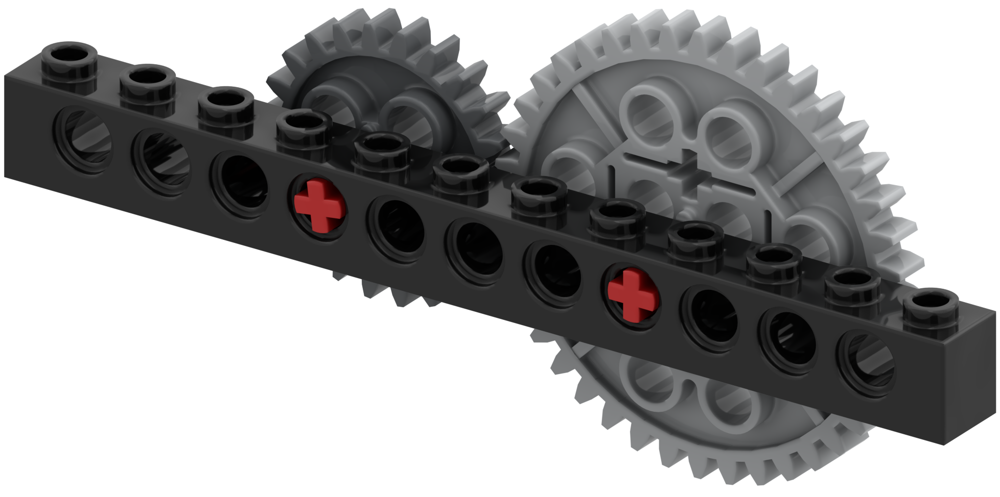

If the tooth sum is divisble by 8, the distance can be achieved by placing the axle at a half unit offset, which is possible with various building techniques:

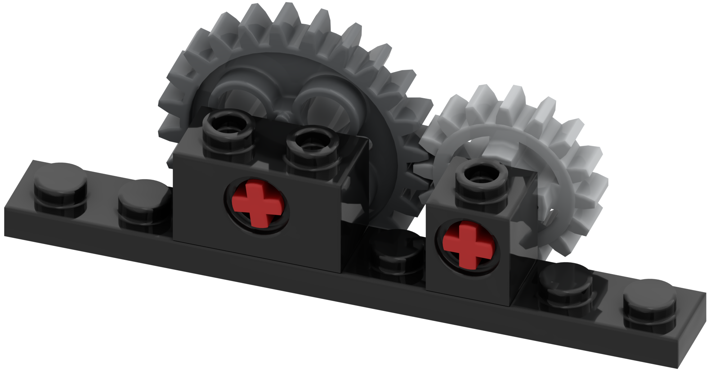

The app has a "Fit gears" tab which will show you possible ways of connecting any given pair of gears.
For example, this is what I call a "2D connection".
These gears fit together if you offset them 1 unit in one direction and 2 units in the second direction, since their distance is quite close to `sqrt(1² + 2²)`:

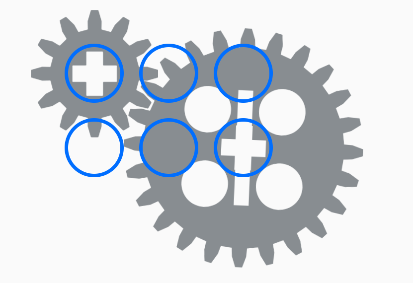

In addition, there are also gears that Lego calls ["bevel gears"](https://www.brickowl.com/search/catalog?query=bevel%20gear&cat=6835), they have `n * 8 + 4` teeth and can be connected perpendicularly, allowing you to change the plane of the meachnism.

So for any pair of a driver and follower gear, there are potential ways to connect them, but some combinations are easier to build and some are harder.
My app assigns a "cost" to each possible pairing of driver and follower gear based on how they can be connected.
If the teeth numbers add up to a multiple of 16, they are the easiest to connect, meaning the cost is the lowest.
Once the tool has a set of driver gears and follower gears, it uses the [Hungarian algorithm](https://en.wikipedia.org/wiki/Hungarian_algorithm) to generate a matching with minimal cost.

Here is an example of a result when searching for a sequence with a ratio of π:

There is one more interesting mathematical curiosity I want to mention.
Lego's differential gears have the property that the differential casing rotates at a rate that is the mean of the rates of the two connected axles.
For example, if one axle rotates once per second and the other axle three times per second, the casing will rotates twice per second (`(1 + 3) / 2`).
We can exploit this to achieve prime factors that are otherwise impossible with Lego gears.

For example, there are no Lego gears with a tooth number that is a multiple of 13, so transmission ratios that include 13 as a prime factor are not possible with the standard approach.
To achieve a transmission ratio of 13, the gear ratio calculator gives us this sequence:

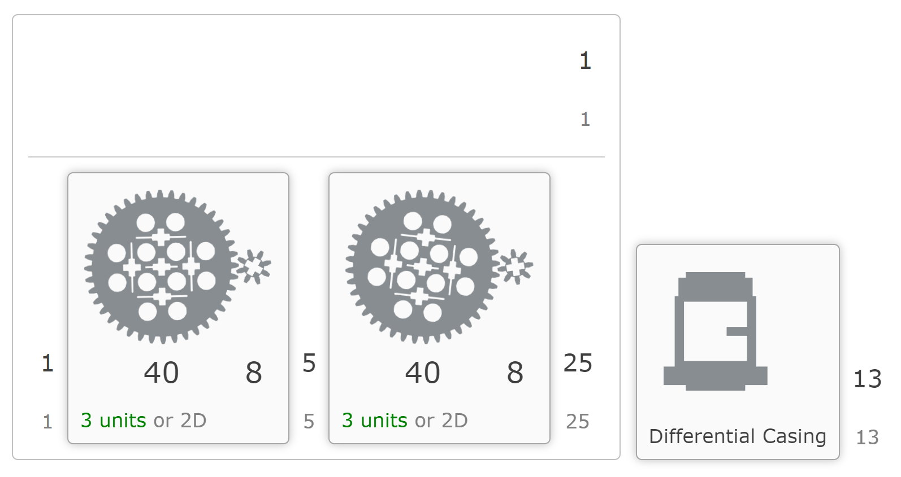

The inputs axles spin at a rate of 1 and 25 and the resulting rate is `(1 + 25) / 2 = 13`.
This how this sequence could be built:

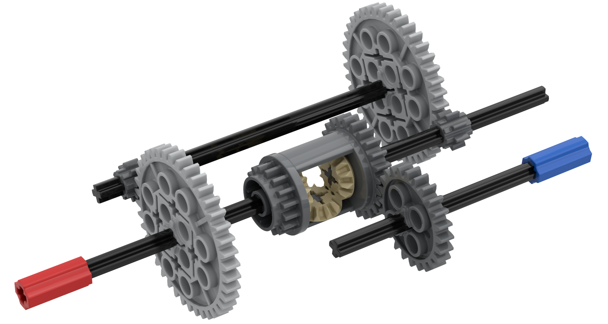

In this example, the blue axle spins 13 times as fast as the red axle.

This brings us to the end of the digression about gear sequences.
The app is available [here](https://marian42.de/gears) if you want to try it out.
The Typescript [source code](https://github.com/marian42/gears) is also available.

Here are all the gears in the final orrery design:

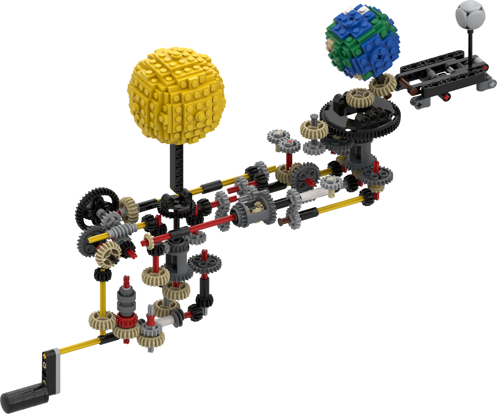

These are the rotational and orbital periods in the orrery, comparing them to the real-world values:

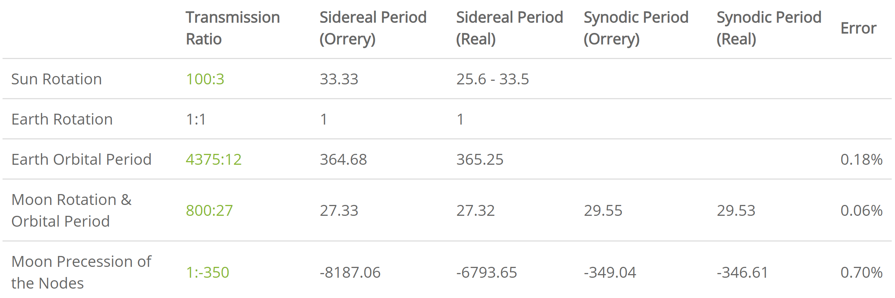

The mechanism was mostly designed using physical parts and my gear sequence app.
This is a work in progress photo:

One of the main challenges during the design of the orrery, besides making it work at all, was to get the orrery to run smoothly.
The final design has 70 gears and each additional gear adds a little bit of friction.
Another source for resistance is the weight of the earth as it spins relatively fast and thus contributes a lot to the torque needed to run the orrery.
I put a lot of effort into making the orrery run smooth.
But the mechanism can easily get stuck, for example if any moving part is assembled too tight or if the orrery gathers dust.
During assembly, it is important to make sure that every moving part has a some slack.

One way to work around this problem is to apply a little bit of silicone spray.
This will make the orrery run effortlessly without any problem.
But arguably a Lego set should be judged by how well it works on its own and purists will say this is like gluing parts together.

# Designing the foot

I took this photo when I first managed to get the entire mechanism to work.
This contains the first version of a foot I designed, which has a Lego motor to drive the orrery.

It turns out that this motor is really loud when it runs and it ruins the experience of using the orrery.
I envision it as a piece that you can use to explain and demonstrate astrodynamic phenomena to someone.
But this doesn't work when the motor noise makes it impossible to have a conversation, so I decided to remove the motor.

Designing the foot turned out quite tricky, it's an artistic challenge more than a technical one.
I went for a 12-segment design, which is a nod to the twelve months and has a [tradition in orrery design](https://collections.whipplemuseum.cam.ac.uk/objects/9010/).

I designed most of the foot digitally using Bricklink Studio.
This part lends itself more to digital design since it doesn't move.
Due to the 12-fold symmetry, testing any idea requires a large number of parts.

Here are some iterations on the foot design:

You can see that each design has a little lever to disengage the driving mechanism from the main arm.
This allows you to move the arm freely, which is quite useful in practice.

Here is a video of the final orrery design in action:



# Instructions

I used [Bricklink Studio](https://www.bricklink.com/v3/studio/download.page) to make a digital model of my orrery.
During the design process, I switched back and forth between buildig with physical parts and designing digitally.

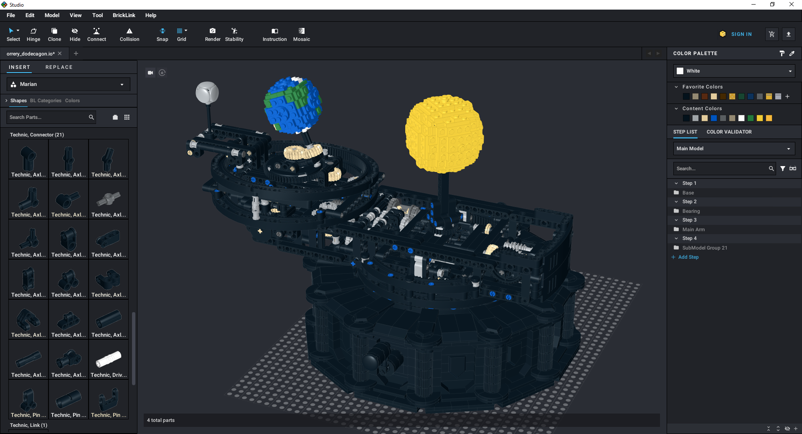

I also used this program to create digital building instructions.
My takeaway from this is that it works really well for small models, but it has serious usability problems on larger models.
When you make changes to the model or change an early step in the instructions, it will often break the layout of the instructions in many places so that most of it needs to be redone.
This was a lot of tedious work, but I ended up with a 264 page, 436 step instructions PDF.

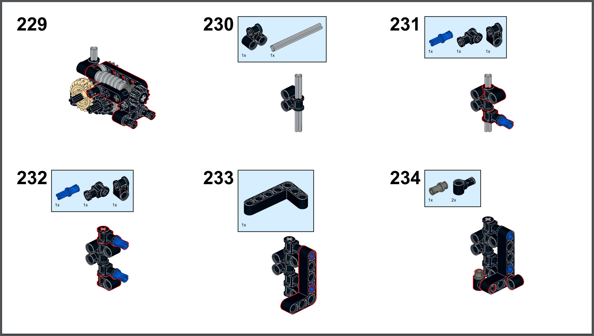

I'm selling the digital instructions for 20€ on [Rebrickable](https://rebrickable.com/mocs/MOC-88534/marian/sun-earth-moon-orrery/).
On Rebrickable, you get a parts list and some really useful tools to help aquiring the parts (even without buying the instructions).
For example, you can tell it which Lego sets and parts you own and based on that it will know which of the required parts of the orrery you already have.
It also helps you with buying the parts you don't have.
Rebrickable estimates that the total cost of the required parts is 260€.
Together with the cost of the instructions, this makes the whole project quite expensive for potential buyers.
I ended up selling a few instructions, but ultimately this project wasn't a commercial success.
In hindsight, it might have been a better idea to give the instructions away for free.

To promote the listing on Rebrickable, I made an animation that shows the movement of the gears in the orrery.
I used [Mecabricks](https://www.mecabricks.com/) to convert the Bricklink Studio design into a scene file that contains 3D meshes of all the parts.
This could then be opened in Blender, where I created all the animations and the camera movement.
Just like making the instructions, this is realtively straight forward, but it became quite complex due to the large number of parts in the design.
Here is the resulting animation (at 45 seconds, the structural parts fade out to reveal the mechanism):



# Lower partcount design

The above design aims to make the best possible Lego orrery with few compromises.
This is at the expense of having a high part count and some parts that are hard to get.
I made a modified [design with a lower part count](https://rebrickable.com/mocs/MOC-95743/marian/sun-earth-moon-orrery-reduced-part-count/) by redesigning the foot.

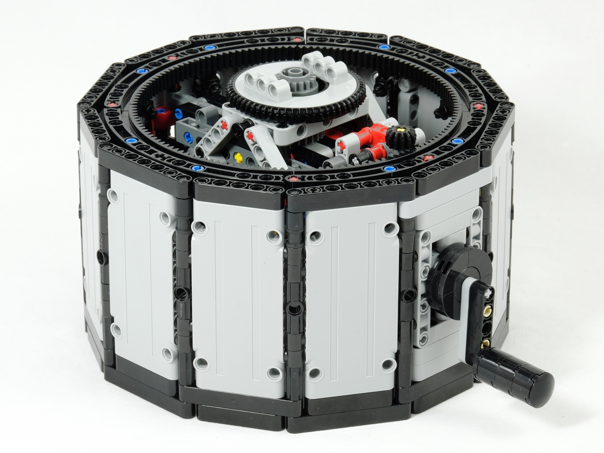

The foot in this version is much lighter, has less ornaments and uses Technic parts instead of traditional bricks.
It has one crank instead of two.
To make it easier to get the parts for this orrery, I changed the design so that it uses as many parts as possible from Lego's [Rough Terrain Crane](https://rebrickable.com/sets/42082-1/rough-terrain-crane/#comments).
I chose this set because it was well reviewed, had a low cost per part, and many people own it.
Unfortunately, Lego has now stopped selling it.

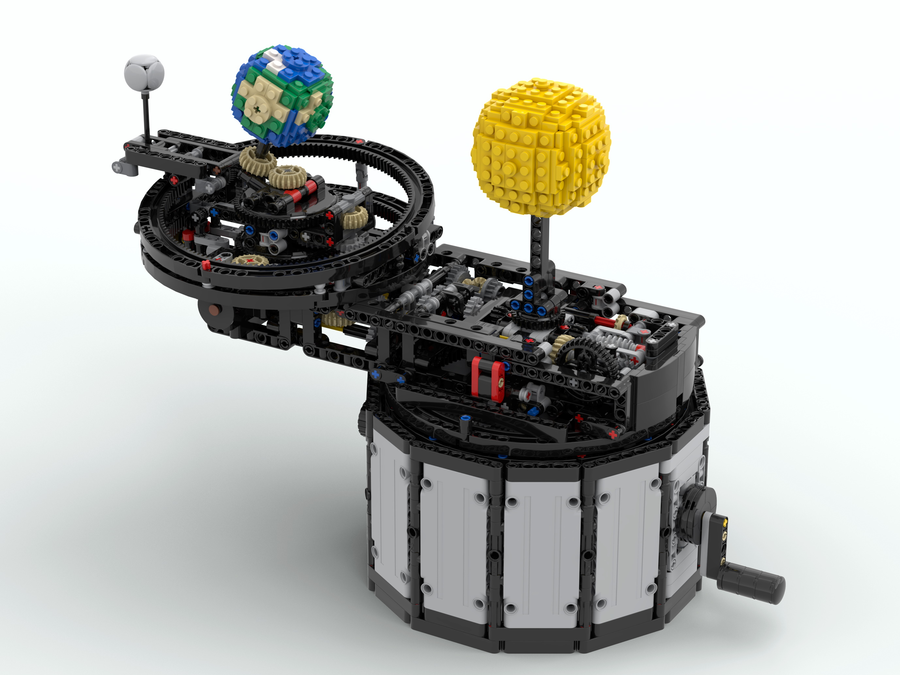

Many parts in my first orrery design use a "traditional" color scheme where gears, pins and axles are mostly gray and black.
This color scheme was used by Lego in the past and is often preferred by fans. 
In the new design, I use the same colors that Lego uses in its current products, which means the parts are easier to get and more of them can be taken from the red crane.
The new, more colorful palette makes the building instructions easier to follow, but the colors can look out of place in the orrery.

# Other orreries

I released the instructions for my orrery in September 2021.
A few months later in 2022, CaDA released [an orrery](https://decadastore.com/products/solar-system-c71004w) designed by JK Brickworks.
This is the designer behind the "original" Lego Orrery from 2016, which got me interested in this hobby in the first place.

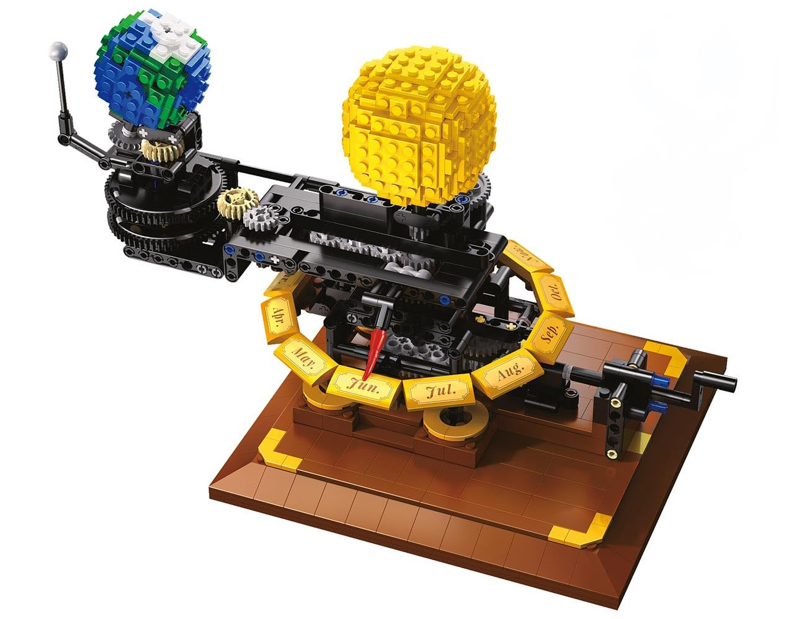

The feature set of this orrery is similar to mine, with the exception that it doesn't model the inclination of the orbit of the moon.
As you can see, omitting this feature lowers the complexity considerably and allows for a much simpler and more reliable design.
The lower part count makes this orrery more accessible to a wider audience.
I'm very impressed with this design and I think it's the best product to get for anyone interested in building an orrery.

Two years later in 2024, Lego released their own orrey design.
I was quite excited at the prospect of an official Lego orrery, but I was disappointed by the execution.

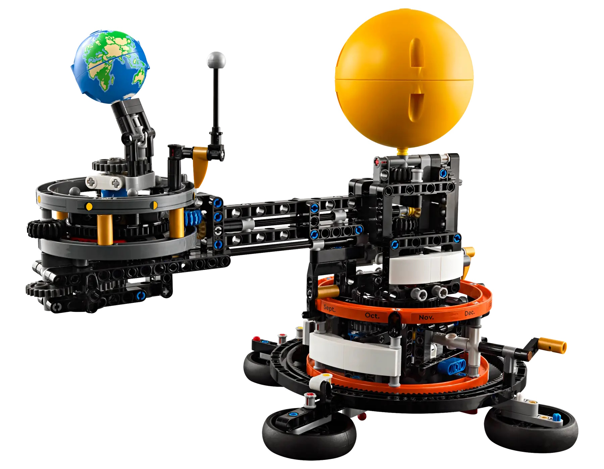

This orrery has the same feature set as the one from CaDA, it has the earth's axial tilt, the moon's orbit but not its inclination.
Compared to the CaDA design, it has less parts but is more expensive.
I think Lego were too aggressive in reducing the part count.
The orrery is very fragile and wobbly.
For the sun and earth, they went with custom hemisphere pieces.
I like the idea, as it allows the bodies to be perfectly spherical.
But the parts have very prominent connection holes, which are unneccesary and ruin the look.
The earth has the continents printed on it, which is a nice idea but the prints were poorly aligned in my model.

All in all, I would recommend the CaDA orrery over this one.
But I'm excited to see that building block orreries are reaching a bigger audience and I hope that companies like CaDA and Lego will offer more elaborate designs in the future.

# Outlook

This is a mockup of an idea to model all the planets in the solar system without vertical stacking (well, except for the inner planets, but it's mostly a flat design).
The four outer planets would move on four tracks of [chains](https://www.brickowl.com/catalog/lego-small-tread-link-3873-15379) that are held in place by the vertical poles (the chains are not shown in the render).
The chain would be driven by a gear attached to the base and the planet would be attached to one of the chain link pieces.
Note that in this setup, the planets only travel around the sun, but don't spin around their own axes.

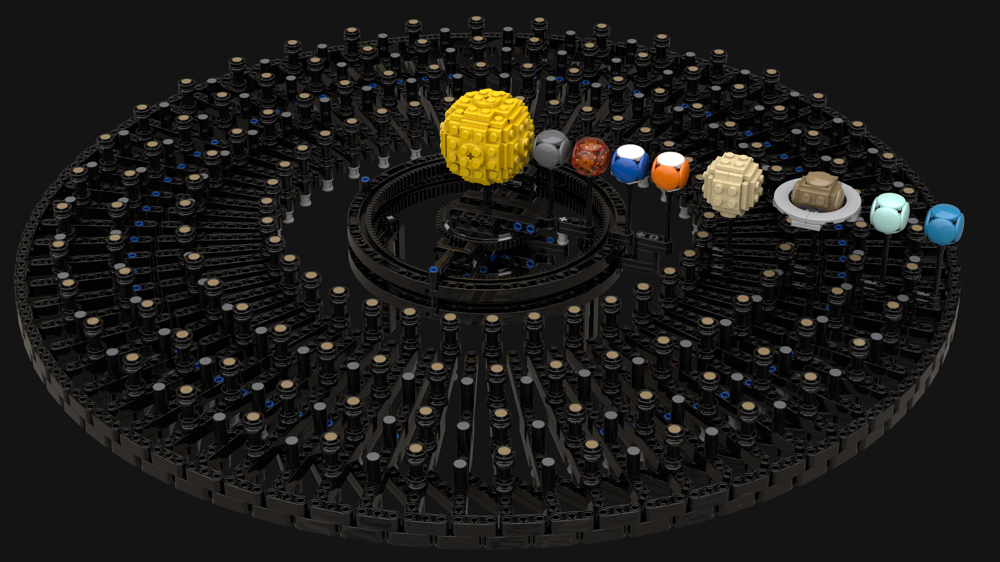

This concept is inspired by a [design for a clock from Akiyuki](https://www.youtube.com/watch?v=GUdlSYC1cCE).
It's hard to tell if the chain could handle the weight of a brick-built planet.
Either way this build would be crazy in terms of dimensions, part count and cost.
At the moment, I'm not planning to continue working on this concept.

If you remove the constraint of no vertical stacking, the problem becomes only slightly easier, but possible as [demonstrated by Chris Orchard and Brent Waller](https://www.youtube.com/watch?v=MTkIezjNLS8) in their [Lego Ideas campaign](https://ideas.lego.com/projects/c600ea70-0e2d-4192-8bbc-79eecbc796e4).

My [next project](https://mastodon.gamedev.place/@marian42/110136556159649621) is to build an orrery using laser cut acrylic sheets instead of Lego parts.
This removes a lot of constraints on the gears and parts that can be used, but has the added difficulty that I need to manufacture these parts myself.